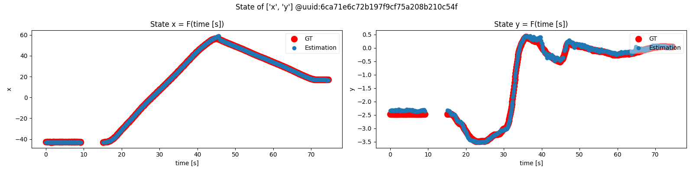
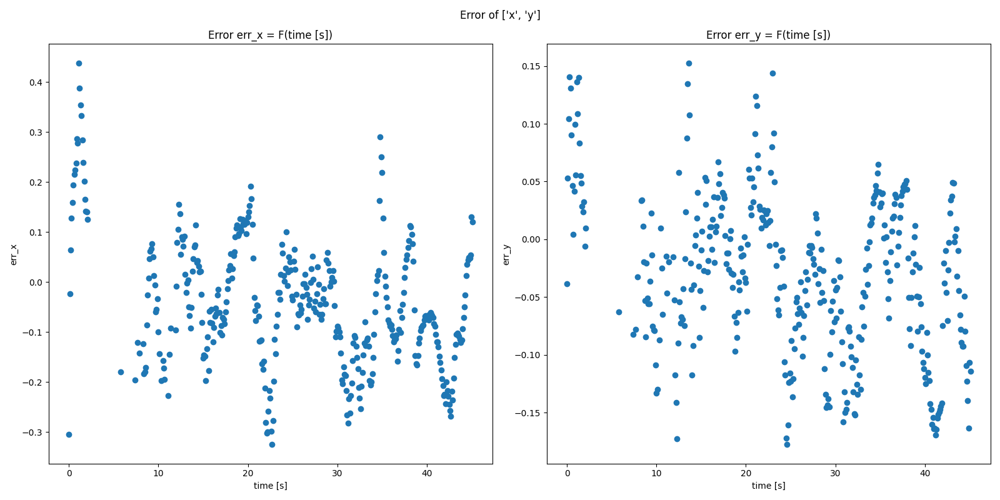
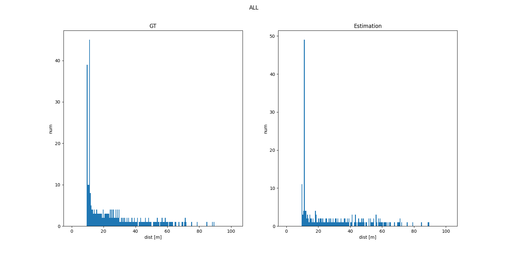
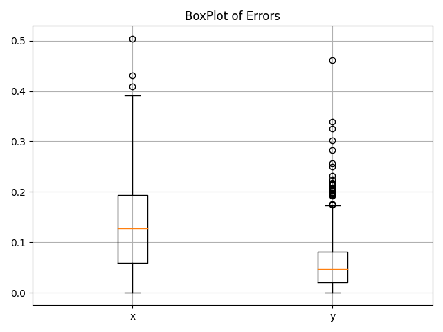

# [`<class> PerceptionAnalyzer3D(...)`](../../../perception_eval/perception_eval/tool/perception_analyzer3d.py)

Analyze results for 3D perception evaluation.

## Type of perception evaluation

There are two types named UseCase and DataBase.

- UseCase = Evaluate metrics and decide PASS/FAIL with defined test scene.

  - Evaluate perception accuracy to guarantee safety as main task.

- DataBase = Evaluate metrics
  - Used for evaluating algorithm ability relatively. It does not guarantee safety.

## Contents of analysis

1. TP rate
2. FN rate
3. FP rate
4. Position accuracy in TP
   - Calculate average, RMS, variance and max/min error
5. Heading accuracy in TP
6. Velocity accuracy in TP (Tracking only)
7. Metrics score (AP, MOTA... e.t.c)

- UseCase

  - Set to filter one object to scenario or PerceptionEvaluationConfig,

- DataBase
  - It is possible to analyze results over dataset.

## How to use

After running driving_log_replayer, evaluation results (`List[PerceptionFrameResult]`) will be saved as a pickle file (`.pkl`).

### 1. Initialization

There are two ways of initialization, 1. with `PerceptionEvaluationConfig`, or 2. with scenario file (`.yaml`).

```python
from perception_eval.tool.perception_performance_analyzer import PerceptionAnalyzer3D


# 1. with PerceptionEvaluationConfig
# REQUIRED:
#   - evaluation_config <PerceptionEvaluationConfig>

analyzer = PerceptionAnalyzer3D(evaluation_config)

# 2. with scenario file (.yaml)
# REQUIRED:
#   - scenario_path <str>

analyzer = PerceptionAnalyzer3D.from_scenario(
    result_root_directory,
    scenario_path,
)
```

### 2. Add frame results

There are two ways of adding `PerceptionFrameResult`, 1. Input `List[PerceptionFrameResult]`, or 2. Input the path of pickle file (`.pkl`).

```python
# 1. with PerceptionFrameResult
# REQUIRED:
#   - frame_results <List[PerceptionFrameResult]>
analyzer.add(frame_results)


# 2. with pickle file (.pkl)
# REQUIRED:
#   - pickle_path: <str>
analyzer.add_from_pkl(pickle_path)
```

```python
>>> analyzer.df
                      timestamp          x         y         w          l  ...
0    ground_truth  1.603763e+15  45.108863  4.415448  3.237000  12.112000
     estimation    1.603763e+15  42.187082  4.216309  2.818074   6.961135
1    ground_truth  1.603763e+15  41.231904  4.528642  3.237000  12.112000
     estimation    1.603763e+15  37.909447  4.304737  2.694330   6.547065
...
```

### 3. Analyze

The methods `analyzer.analyze()` calculate the analysis score． To analyze only the Nth scene, specify `analyzer.analyze(scene=N)`.

```python
>>> score_df, error_df = analyzer.analyze()
>>> print(score_df)
                    TP   FP        FN  AP(Center Distance 3d [m])  APH(Center Distance 3d [m])  AP(IoU BEV)  APH(IoU BEV)  AP(IoU 3D)  APH(IoU 3D)  AP(Plane Distance [m])  APH(Plane Distance [m])
ALL         0.992003  0.0  0.007997                    0.972918                     0.970923     0.972918      0.970923    0.972918     0.970923                0.972918                 0.970923
car         1.000000  0.0  0.000000                    1.000000                     0.999460     1.000000      0.999460    1.000000     0.999460                1.000000                 0.999460
bicycle     0.958561  0.0  0.041439                    1.000000                     1.000000     1.000000      1.000000    1.000000     1.000000                1.000000                 1.000000
pedestrian  0.991278  0.0  0.008722                    0.900682                     0.896454     0.900682      0.896454    0.900682     0.896454                0.900682                 0.896454

>>> print(error_df)
ALL        x         1.394186  1.588129  7.605266e-01  2.300000  0.285734
           y         0.459921  0.611391  4.028307e-01  1.017925  0.000000
           yaw       0.188019  0.218617  1.115459e-01  0.390857  0.006516
           vx        0.016197  0.058724  5.644617e-02  0.635254  0.000000
           vy        0.062738  0.229145  2.203886e-01  1.721179  0.000000
           nn_plane  0.656631  0.902214  6.187298e-01  2.190708  0.000663
car        x         2.300000  2.300000  7.588600e-16  2.300000  2.300000
           y         0.000000  0.000000  0.000000e+00  0.000000  0.000000
           yaw       0.198764  0.198813  4.444152e-03  0.200147  0.182285
           vx        0.000000  0.000000  0.000000e+00  0.000000  0.000000
           vy        0.000000  0.000000  0.000000e+00  0.000000  0.000000
           nn_plane  0.779659  1.107139  7.860584e-01  2.116297  0.004645
bicycle    x         1.009088  1.154043  5.599603e-01  1.900625  0.310774
           y         0.559406  0.649149  3.293320e-01  0.908261  0.003252
           yaw       0.107742  0.143227  9.437081e-02  0.268970  0.006516
           vx        0.000000  0.000000  0.000000e+00  0.000000  0.000000
           vy        0.000000  0.000000  0.000000e+00  0.000000  0.000000
           nn_plane  0.564198  0.760262  5.095874e-01  1.926336  0.000663
pedestrian x         1.135335  1.324417  6.819782e-01  2.300000  0.285734
           y         0.752706  0.817092  3.179199e-01  1.017925  0.000000
           yaw       0.312139  0.319201  6.677537e-02  0.390857  0.178998
           vx        0.059606  0.112652  9.559111e-02  0.635254  0.000000
           vy        0.230876  0.439575  3.740625e-01  1.721179  0.000000
           nn_plane  0.688891  0.893696  5.693175e-01  2.190708  0.020005
```

## `<class> PerceptionAnalyzer3D(...)`

| Arguments           |             type             | Mandatory | Description                                                    |
| :------------------ | :--------------------------: | :-------: | :------------------------------------------------------------- |
| `evaluation_config` | `PerceptionEvaluationConfig` |    Yes    | Configuration of `PerceptionEvaluationManager`                 |
| `num_area_division` |            `int`             |    No     | Number of area division(Options=[`1`, `3`, `9`]; Defaults=`1`) |

- By specifying `num_area_division`, analyze dividing area around ego as below.
  - `max_x/y_position` or `max/min_distance` specified in `evaluation_config` will be used. Defaults to `100.0[m]`.

```python
        1:                            3:                  9:
                    max_x_position
                    +--------+          +--------+          +--------+
                    |    0   |          |____0___|          |_0|_1|_2|
    max_y_position  |    +   |          |____1___|          |_3|_4|_5|
                    |   ego  |          |    2   |          | 6| 7| 8|
                    +--------+          +--------+          +--------+
```

### Attributes

| name                |             type             | Description                                    |
| :------------------ | :--------------------------: | :--------------------------------------------- |
| `config`            | `PerceptionEvaluationConfig` | Configuration of `PerceptionEvaluationManager` |
| `df`                |      `pandas.DataFrame`      | All DataFrame                                  |
| `plot_directory`    |            `str`             | Directory path to save plot                    |
| `num_frame`         |            `int`             | Number of total frames                         |
| `num_scene`         |            `int`             | Number of total scenes                         |
| `num_area_division` |            `int`             | Number of area divisions                       |
| `num_ground_truth`  |            `int`             | Number of GT                                   |
| `num_estimation`    |            `int`             | Number of estimations                          |
| `num_tp`            |            `int`             | Number of TP                                   |
| `num_fp`            |            `int`             | Number of FP                                   |
| `num_fn`            |            `int`             | Number of FN                                   |

### Basic methods

| name                     |                                          input                                          |       return       | Description                                                                                                   |
| :----------------------- | :-------------------------------------------------------------------------------------: | :----------------: | :------------------------------------------------------------------------------------------------------------ |
| `get()`                  |                                   `*args`, `**kwargs`                                   | `pandas.DataFrame` | DataFrame of columns specified in `args` or `kwargs`                                                          |
| `sortby()`               | `Union[str, List[str]]`, `df<Optional[pandas.DataFrame]>=None`, `ascending<bool>=False` | `pandas.DataFrame` | DataFrame sorted by columns specified in `Union[str, List[str]]`. `ascending=True` makes it ascending order.  |
| `head()`                 |                                          `int`                                          | `pandas.DataFrame` | DataFrame the length of number of raws specified in `int(Defaults=5)` from top.                               |
| `tail()`                 |                                          `int`                                          | `pandas.DataFrame` | DataFrame the length of number of raws specified in `int(Defaults=5)` from bottom.                            |
| `shape()`                |                            `Optional[Union[str, List[str]]]`                            |    `Tuple[int]`    | Shape of DataFrame (row, column) specified in `int(Defaults=5)` from top.                                     |
| `keys()`                 |                                                                                         |     `pd.Index`     | Name of column of `self.df`                                                                                   |
| `get_ground_truth()`     |                      `df=<Optional[pandas.DataFrame]>`, `**kwargs`                      | `pandas.DataFrame` | DataFrame of GT.                                                                                              |
| `get_estimation()`       |                      `df=<Optional[pandas.DataFrame]>`, `**kwargs`                      | `pandas.DataFrame` | DataFrame of estimation.                                                                                      |
| `get_num_ground_truth()` |                      `df=<Optional[pandas.DataFrame]>`, `**kwargs`                      |       `int`        | Number of GT.                                                                                                 |
| `get_num_estimation()`   |                      `df=<Optional[pandas.DataFrame]>`, `**kwargs`                      |       `int`        | Number of estimation.                                                                                         |
| `get_num_tp()`           |                      `df=<Optional[pandas.DataFrame]>`, `**kwargs`                      |       `int`        | Number of TP.                                                                                                 |
| `get_num_fp()`           |                      `df=<Optional[pandas.DataFrame]>`, `**kwargs`                      |       `int`        | Number of FP.                                                                                                 |
| `get_num_fn()`           |                      `df=<Optional[pandas.DataFrame]>`, `**kwargs`                      |       `int`        | Number of FN.                                                                                                 |
| `get_ego2map()`          |                              `scene=<int>`, `frame=<int>`                               |  `numpy.ndarray`   | Homogeneous transformation matrix transforming coordinates with respect to base_link to map, in shape (4, 4). |

- `get()` returns columns of DataFrame specified in `*args` and meet requirements specified in `**kwargs`.

```python
>>> analyzer = PerceptionAnalyzer3D(...)

# Example: Returns xy and uuid columns labeled as truck
>>> analyzer.get("x", "y", "uuid", label="truck")
                         x          y                              uuid
0  ground_truth  85.536254   2.151734  a0e19d9fc8e528fb471d0d29bdf32927
   estimation    83.445015   2.306474                              None
1  ground_truth  82.125830   2.415408  a0e19d9fc8e528fb471d0d29bdf32927
   estimation    77.737808   2.873984                              None
2  ground_truth  49.703061   4.212113  a0e19d9fc8e528fb471d0d29bdf32927
   estimation    46.329472   4.206718                              None
3  ground_truth  27.750345   4.546522  a0e19d9fc8e528fb471d0d29bdf32927
   estimation    89.282616  -6.042823                              None
4  ground_truth  27.750345   4.546522  a0e19d9fc8e528fb471d0d29bdf32927
...
```

- `get_**()` returns DataFrame meets requirements specified in `**kwargs` like `COLUMN_NAME=value`.

```python
# Example: Returns number of GT labeled as car
>>> analyzer.get_num_ground_truth(label="car")
5223
```

### DataFrame structure

- By `add()` method, each `PerceptionFrameResult` will be accumulated as following format. The number of order (1,...,N) will be assigned to `scene`.
  - x,y,yaw,vx,vy are with respect to base_link coordinates system.

| index | type             | "timestamp" |   "x"   |   "y"   |   "w"   |   "l"   |   "h"   |  "yaw"  |  "vx"   |  "vy"   |  "nn_point1"   |  "nn_point2"   | "label" | "confidence" | "uuid" | "num_points" | "status" | "area" | "frame" | "scene" |
| ----: | :--------------- | :---------: | :-----: | :-----: | :-----: | :-----: | :-----: | :-----: | :-----: | :-----: | :------------: | :------------: | :-----: | :----------: | :----: | :----------: | :------: | :----: | :-----: | :-----: |
|     0 | **ground_truth** |   `float`   | `float` | `float` | `float` | `float` | `float` | `float` | `float` | `float` | `tuple[float]` | `tuple[float]` |  `str`  |   `float`    | `str`  |    `int`     |  `str`   | `int`  |  `int`  |  `int`  |
|       | **estimation**   |

- `PerceptionAnalyzer3D.df` allow to show the DataFrame

```python
>>> analyzer.df
                      timestamp          x         y         w          l  ...
0    ground_truth  1.603763e+15  45.108863  4.415448  3.237000  12.112000
     estimation    1.603763e+15  42.187082  4.216309  2.818074   6.961135
1    ground_truth  1.603763e+15  41.231904  4.528642  3.237000  12.112000
     estimation    1.603763e+15  37.909447  4.304737  2.694330   6.547065
...
```

- Available to reference elements only for GT or estimation.

```python
>>> analyzer.get_ground_truth()
         timestamp          x         y         w       l         h       yaw ...
0     1.603763e+15  45.108863  4.415448  3.237000  12.112  3.816000  0.056254
1     1.603763e+15  41.231904  4.528642  3.237000  12.112  3.816000  0.059814
2     1.603763e+15  38.064378  4.594842  3.237000  12.112  3.816000  0.062258
...
```

```python
>>> analyzer.get_estimation()
         timestamp          x         y         w       l         h       yaw ...
0     1.603763e+15  45.108863  4.415448  3.237000  12.112  3.816000  0.056254
1     1.603763e+15  41.231904  4.528642  3.237000  12.112  3.816000  0.059814
2     1.603763e+15  38.064378  4.594842  3.237000  12.112  3.816000  0.062258
...
```

### Analyze

- `<func> summarize_ratio() -> pandas.DataFrame`
  - Calculate TP rate, FN rate, FP rate for each label.

| label |  "TP"   |  "FN"   |  "FP"   |
| :---- | :-----: | :-----: | :-----: |
| `str` | `float` | `float` | `float` |

```python
>>> analyzer.summarize_ratio()
                  TP   FP        FN
All         0.992003  0.0  0.007997
car         1.000000  0.0  0.000000
pedestrian  0.991278  0.0  0.008722
motorbike   1.000000  0.0  0.000000
bicycle     0.958561  0.0  0.041439
```

- `<func> summarize_score() -> pandas.DataFrame`

| label |  "AP"   |  "APH"  | "MOTA"  | "MOTP"  | "IDswitch" |
| :---- | :-----: | :-----: | :-----: | :-----: | :--------: |
| `str` | `float` | `float` | `float` | `float` |   `int`    |

```python
>>> analyzer.summarize_score()
            AP(Center Distance 3d [m])  APH(Center Distance 3d [m])  AP(IoU BEV)  APH(IoU BEV)  AP(IoU 3D)  ...  MOTP(IoU 3D)  IDswitch(IoU 3D)  MOTA(Plane Distance [m])  MOTP(Plane Distance [m])  IDswitch(Plane Distance [m])
ALL                           0.972918                     0.963204     0.972918      0.963204    0.972918  ...           1.0                 0                  0.984711                       0.0                             0
car                           1.000000                     1.000000     1.000000      1.000000    1.000000  ...           1.0                 0                  1.000000                       0.0                             0
pedestrian                    0.900682                     0.900682     0.900682      0.900682    0.900682  ...           1.0                 0                  0.900682                       0.0                             0
motorbike                     0.990989                     0.952135     0.990989      0.952135    0.990989  ...           1.0                 0                  0.990989                       0.0                             0
bicycle                       1.000000                     1.000000     1.000000      1.000000    1.000000  ...           1.0                 0                  1.000000                       0.0                             0
```

- `<func> summarize_error() -> pandas.DataFrame`
  - Calculate average, RMS, std, max and min error for each label.

| label | element | "average" |  "rms"  |  "std"  |  "max"  |  "min"  |
| :---- | :------ | :-------: | :-----: | :-----: | :-----: | :-----: |
| `str` | `str`   |  `float`  | `float` | `float` | `float` | `float` |

```python
>>> analyzer.summarize_error()
ALL        x         1.394186  1.588129  7.605266e-01  2.300000  0.285734
           y         0.459921  0.611391  4.028307e-01  1.017925  0.000000
           yaw       0.188019  0.218617  1.115459e-01  0.390857  0.006516
           vx        0.016197  0.058724  5.644617e-02  0.635254  0.000000
           vy        0.062738  0.229145  2.203886e-01  1.721179  0.000000
           nn_plane  0.656631  0.902214  6.187298e-01  2.190708  0.000663
car        x         2.300000  2.300000  7.588600e-16  2.300000  2.300000
           y         0.000000  0.000000  0.000000e+00  0.000000  0.000000
           yaw       0.198764  0.198813  4.444152e-03  0.200147  0.182285
           vx        0.000000  0.000000  0.000000e+00  0.000000  0.000000
           vy        0.000000  0.000000  0.000000e+00  0.000000  0.000000
           nn_plane  0.779659  1.107139  7.860584e-01  2.116297  0.004645
bicycle    x         1.009088  1.154043  5.599603e-01  1.900625  0.310774
           y         0.559406  0.649149  3.293320e-01  0.908261  0.003252
           yaw       0.107742  0.143227  9.437081e-02  0.268970  0.006516
           vx        0.000000  0.000000  0.000000e+00  0.000000  0.000000
           vy        0.000000  0.000000  0.000000e+00  0.000000  0.000000
           nn_plane  0.564198  0.760262  5.095874e-01  1.926336  0.000663
pedestrian x         1.135335  1.324417  6.819782e-01  2.300000  0.285734
           y         0.752706  0.817092  3.179199e-01  1.017925  0.000000
           yaw       0.312139  0.319201  6.677537e-02  0.390857  0.178998
           vx        0.059606  0.112652  9.559111e-02  0.635254  0.000000
           vy        0.230876  0.439575  3.740625e-01  1.721179  0.000000
           nn_plane  0.688891  0.893696  5.693175e-01  2.190708  0.020005
```

### Plot functions

- `<enum> PlotAxes`

  - A class to specify plot axes.

    | Member       | Description                             |
    | :----------- | :-------------------------------------- |
    | `FRAME`      | The number of frame.                    |
    | `TIME`       | Time[s].                                |
    | `DISTANCE`   | Distance[m] from ego vehicle.           |
    | `X`          | x position[m] from ego vehicle.         |
    | `Y`          | y position[m] from ego vehicle.         |
    | `VX`         | longitudinal velocity[m/s].             |
    | `VY`         | lateral velocity[m/s].                  |
    | `CONFIDENCE` | Confidence of estimation[GT=1.0](0, 1). |
    | `POSITION`   | xy position[m] from ego vehicle.        |
    | `VELOCITY`   | xy velocity[m/s].                       |
    | `POLAR`      | polar coordinates, (theta[rad], r[m]).  |

- `<func> plot_state(...) -> None`

  - Plot the state change over time for specified GT with uuid.

    | Arguments |                  type                  | Mandatory | Description                                          |
    | :-------- | :------------------------------------: | :-------: | :--------------------------------------------------- |
    | `uuid`    |                 `str`                  |    Yes    | GT object's uuid.                                    |
    | `column`  |                 `str`                  |    Yes    | Column name．(Options=[`x`, `y`, `yaw`, `vx`, `vy`]) |
    | `mode`    |               `PlotAxes`               |    No     | Target plot axes. (Defaults=`PlotAxes.TIME`)         |
    | `status`  | `Optional[Union[str, MatchingStatus]]` |    No     | Matching status TP/FP/FN. (Defaults=`None`)          |
    | `show`    |                 `bool`                 |    No     | Whether show plot result. (Defaults=`False`)         |

    ```python
    # Example: Plot an object's xy with uuid: "4bae7e75c7de70be980ce20ce8cbb642"
    >> analyzer.plot_by_time("4bae7e75c7de70be980ce20ce8cbb642", ["x", "y"])
    ```

  

- `<func> plot_error(...) -> None`

  - Plot error of specified states between GT and estimation.

  | Arguments |          type           | Mandatory | Description                                                    |
  | :-------- | :---------------------: | :-------: | :------------------------------------------------------------- |
  | `columns` | `Union[str, List[str]]` |    Yes    | Column name. (Options=[`x`, `y`, `yaw`, `w`, `l`, `vx`, `vy`]) |
  | `mode`    |       `PlotAxes`        |    No     | Target plot axes. (Defaults=`PlotAxes.TIME`)                   |
  | `show`    |         `bool`          |    No     | Whether show plot result. (Defaults=`False`)                   |

  ```python
  # Example: Plot xy error with time axis
  >> analyzer.plot_error(["x", "y"])
  ```

  

- `<func> plot_num_object(...) -> None`

  - Plot number of objects by distance from `base_link` in histogram

  | Arguments |    type    | Mandatory | Description                                      |
  | :-------- | :--------: | :-------: | :----------------------------------------------- |
  | `mode`    | `PlotAxes` |    No     | Target plot axes. (Defaults=`PlotAxes.DISTANCE`) |
  | `bin`     |  `float`   |    No     | Bin of distance. (Defaults=`0.5`)                |
  | `show`    |   `bool`   |    No     | Whether sho plot result.(Defaults=`False`)       |

  ```python
  # Plot the number of all objects
  >> analyzer.plot_num_object()
  ```

  

## Known issues / Limitations

- `PerceptionAnalyzer3D()` only supports 3D evaluation.
  

- `<func> box_plot(...) -> None`

  - Plot specified state's error with box-plot.

  | Arguments |          type          | Mandatory | Description                            |
  | :-------- | :--------------------: | :-------: | :------------------------------------- |
  | `columns` | `Union[str, List[str]` |    Yes    | Target error (x, y, yaw, w, l, vx, vy) |
  | `show`    |         `bool`         |    No     | Whether show plot.(Defaults=`False`)   |

  ```python
  # Plot xy error with box-plot.
  >> analyzer.box_plot(["x", "y"])
  ```

  

## [`<class> Gmm(...)`](../../../perception_eval/perception_eval/tool/gmm.py)

A wrapper class of [`sklearn.mixture.GaussianMixture`](https://scikit-learn.org/stable/modules/generated/sklearn.mixture.GaussianMixture.html).
This model estimates the parameters for the joint distribution P(X, Y).
And then, it predicts means of posterior distribution P(Y|X), where X represents states, Y represents error states.

- Initialization

  | Arguments      | type  | Description                                                 |
  | :------------- | :---: | :---------------------------------------------------------- |
  | `max_k`        | `int` | Maximum number of cluster K.                                |
  | `n_init`       | `int` | Number of initial cluster. (Default: 1)                     |
  | `random_state` | `int` | Seed to save the state of a random function. (Default=1234) |

- Methods

  | Methods           |     Returns     | Description                                                   |
  | :---------------- | :-------------: | :------------------------------------------------------------ |
  | `fit()`           |     `None`      | Estimate model parameters with the EM algorithm.              |
  | `predict()`       | `numpy.ndarray` | Predict means of posterior distribution for the data samples. |
  | `predict_label()` | `numpy.ndarray` | Predict the labels for the data samples.                      |
  | `save()`          |     `None`      | Save estimated the best model's parameters with pickle.       |
  | `load()`          |      `GMM`      | Load saved model's parameters from pickle.                    |
  | `plot_ic()`       |     `None`      | Plot Information Criterion scores, which are AIC and BIC.     |

### `<func> load_sample(...) -> Tuple[numpy.ndarray, numpy.ndarray]`

- Returns input array of specified states and errors.

| Arguments  |          type          | Mandatory | Description                      |
| :--------- | :--------------------: | :-------: | :------------------------------- |
| `analyzer` | `PerceptionAnalyzer3D` |    Yes    | `PerceptionAnalyzer3D` instance. |
| `state`    |      `List[str]`       |    Yes    | List of target state names.      |
| `error`    |      `List[str]`       |    Yes    | List of target error names.      |

### Example usage

```python
from perception_eval.tool import PerceptionAnalyzer3D, Gmm, load_sample
import numpy as np

# Initialize PerceptionAnalyzer3D
analyzer = PerceptionAnalyzer3D(...)

# Load sample data, X: state, Y: error
state = ["x", "y", "yaw", "vx", "xy"]
error = ["x", "y"]

# X: (N, 5), Y: (N, 2)
X, Y = load_sample(analyzer, state, error)
sample = np.concatenate([X, Y], axis=-1)  # (N, 7)

# Estimated model parameters
model = Gmm(max_k)
model.fit(sample)

# Predict Y(error) using X(state)
y_pred = model.predict(X)  # (N, 2)
```
