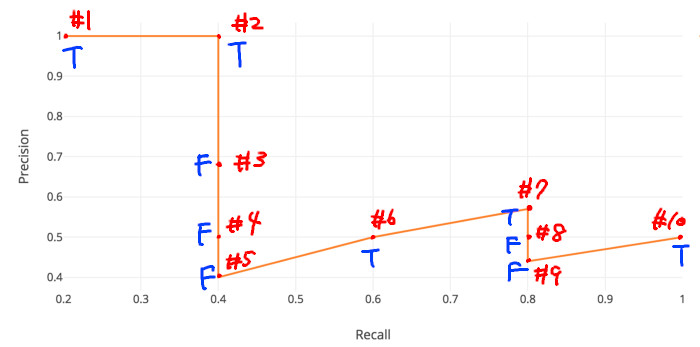

# Perception Evaluation Metrics

## [`<class> MetricsScore(...)`](../../../perception_eval/perception_eval/evaluation/metrics/metrics.py)

- A class to evaluate each of detection/tracking/prediction task

| Argument |         type         | Description                               |
| :------- | :------------------: | :---------------------------------------- |
| `config` | `MetricsScoreConfig` | Configuration settings for `MetricsScore` |

- Initialize `detection/tracking/prediction_config` from input MetricsConfig

  - [`detection_config (DetectionMetricsConfig)`](../../../perception_eval/perception_eval/evaluation/metrics/config/detection_metrics_config.py)
  - [`tracking_config (TrackingMetricsConfig)`](../../../perception_eval/perception_eval/evaluation/metrics/config/tracking_metrics_config.py)
  - [`prediction_config (PredictionMetricsConfig)`](../../../perception_eval/perception_eval/evaluation/metrics/config/prediction_metrics_config.py)
  - [`classification_config (ClassificationMetricsConfig)`](../../../perception_eval/perception_eval/evaluation/metrics/config/classification_metrics_config.py)

- Calculate each metrics based on each config

  - 3D evaluation

  | Evaluation Task |      Metrics       |
  | :-------------- | :----------------: |
  | `Detection`     |     mAP / mAPH     |
  | `Tracking`      | mAP / mAPH / CLEAR |
  | `Prediction`    |       [TBD]        |

  - 2D evaluation

  | Task               |   Metrics   |
  | :----------------- | :---------: |
  | `Detection2D`      |     mAP     |
  | `Tracking2D`       | mAP / CLEAR |
  | `Classification2D` |  Accuracy   |

```yaml
[2022-08-09 18:56:45,237] [INFO] [perception_lsim.py:214 <module>] Detection Metrics example (final_metric_score):
{'detection_config': {'center_distance_thresholds': [[1.0, 1.0, 1.0, 1.0], [2.0, 2.0, 2.0, 2.0]],
                      'iou_3d_thresholds': [[0.5, 0.5, 0.5, 0.5]],
                      'iou_bev_thresholds': [[0.5, 0.5, 0.5, 0.5]],
                      'plane_distance_thresholds': [[2.0, 2.0, 2.0, 2.0], [3.0, 3.0, 3.0, 3.0]],
                      'target_labels': ['AutowareLabel.CAR', 'AutowareLabel.BICYCLE', 'AutowareLabel.PEDESTRIAN',
                                        'AutowareLabel.MOTORBIKE']},
 'maps': ' --- length of element 6 ---,',
 'num_ground_truth_dict': {<AutowareLabel.PEDESTRIAN: 'pedestrian'>: 7657,
                           <AutowareLabel.MOTORBIKE: 'motorbike'>: 335,
                           <AutowareLabel.BICYCLE: 'bicycle'>: 1319,
                           <AutowareLabel.CAR: 'car'>: 3770},
 'prediction_config': None,
 'prediction_scores': [],
 'tracking_config': None,
 'tracking_scores': []}

 [2022-08-09 18:57:53,888] [INFO] [perception_lsim.py:270 <module>] Tracking Metrics example (tracking_final_metric_score):
{'detection_config': {'center_distance_thresholds': [[1.0, 1.0, 1.0, 1.0], [2.0, 2.0, 2.0, 2.0]],
                      'iou_3d_thresholds': [[0.5, 0.5, 0.5, 0.5]],
                      'iou_bev_thresholds': [[0.5, 0.5, 0.5, 0.5]],
                      'plane_distance_thresholds': [[2.0, 2.0, 2.0, 2.0], [3.0, 3.0, 3.0, 3.0]],
                      'target_labels': ['AutowareLabel.CAR', 'AutowareLabel.BICYCLE', 'AutowareLabel.PEDESTRIAN',
                                        'AutowareLabel.MOTORBIKE']},
 'maps': ' --- length of element 6 ---,',
 'num_ground_truth_dict': {<AutowareLabel.PEDESTRIAN: 'pedestrian'>: 7657,
                           <AutowareLabel.MOTORBIKE: 'motorbike'>: 335,
                           <AutowareLabel.BICYCLE: 'bicycle'>: 1319,
                           <AutowareLabel.CAR: 'car'>: 3770},
 'prediction_config': None,
 'prediction_scores': [],
 'tracking_config': {'center_distance_thresholds': [[1.0, 1.0, 1.0, 1.0], [2.0, 2.0, 2.0, 2.0]],
                     'iou_3d_thresholds': [[0.5, 0.5, 0.5, 0.5]],
                     'iou_bev_thresholds': [[0.5, 0.5, 0.5, 0.5]],
                     'plane_distance_thresholds': [[2.0, 2.0, 2.0, 2.0], [3.0, 3.0, 3.0, 3.0]],
                     'target_labels': ['AutowareLabel.CAR', 'AutowareLabel.BICYCLE', 'AutowareLabel.PEDESTRIAN',
                                       'AutowareLabel.MOTORBIKE']},
 'tracking_scores': ' --- length of element 6 ---,'}

```

## Detection

### [`<class> Map(...)`](../../../perception_eval/perception_eval/evaluation/metrics/detection/map.py)

- A class to calculate mAP (mean Average Prevision)

  - As internal process, calculating AP (Average Precision) and APH (Average Precision Weighted by Heading)
  - Compute mAP, mAPH by meaning above results for each label

#### AP calculation

- Precision and Recall are formulated based on the decision of TP/FP/FN as below

  

  

- The area of under curve is AP(APH). The curve is called PR-curve(Precision Recall-curve).

  

- In actual AP(APH) calculation, the curve is interpolated as below.

  

```yaml
[2022-08-09 18:56:45,238] [INFO] [perception_lsim.py:220 <module>] mAP result example (final_metric_score.maps[0].aps[0]):
{'aphs': [{'ap': 0.0,
           'fp_list': ' --- length of element 3768 ---,',
           'matching_average': 2.3086792761230375,
           'matching_mode': 'MatchingMode.CENTERDISTANCE',
           'matching_standard_deviation': 1.7793252530202338e-15,
           'matching_threshold_list': [1.0],
           'num_ground_truth': 3770,
           'objects_results_num': 3768,
           'target_labels': ['AutowareLabel.CAR'],
           'tp_list': ' --- length of element 3768 ---,',
           'tp_metrics': {'mode': 'TPMetricsAph'}},
          {'ap': 0.0,
           'fp_list': ' --- length of element 1186 ---,',
           'matching_average': 2.291362716605052,
           'matching_mode': 'MatchingMode.CENTERDISTANCE',
           'matching_standard_deviation': 0.828691650821576,
           'matching_threshold_list': [1.0],
           'num_ground_truth': 1319,
           'objects_results_num': 1186,
           'target_labels': ['AutowareLabel.BICYCLE'],
           'tp_list': ' --- length of element 1186 ---,',
           'tp_metrics': {'mode': 'TPMetricsAph'}},
          {'ap': 0.010345232018551354,
           'fp_list': ' --- length of element 7583 ---,',
           'matching_average': 2.7900883035521864,
           'matching_mode': 'MatchingMode.CENTERDISTANCE',
           'matching_standard_deviation': 3.6498079706351123,
           'matching_threshold_list': [1.0],
           'num_ground_truth': 7657,
           'objects_results_num': 7583,
           'target_labels': ['AutowareLabel.PEDESTRIAN'],
           'tp_list': ' --- length of element 7583 ---,',
           'tp_metrics': {'mode': 'TPMetricsAph'}},
          {'ap': 0.0,
           'fp_list': ' --- length of element 335 ---,',
           'matching_average': 2.308679276123039,
           'matching_mode': 'MatchingMode.CENTERDISTANCE',
           'matching_standard_deviation': 1.8215173398221747e-15,
           'matching_threshold_list': [1.0],
           'num_ground_truth': 335,
           'objects_results_num': 335,
           'target_labels': ['AutowareLabel.MOTORBIKE'],
           'tp_list': ' --- length of element 335 ---,',
           'tp_metrics': {'mode': 'TPMetricsAph'}}],
 'aps': [{'ap': 0.0,
          'fp_list': ' --- length of element 3768 ---,',
          'matching_average': 2.3086792761230375,
          'matching_mode': 'MatchingMode.CENTERDISTANCE',
          'matching_standard_deviation': 1.7793252530202338e-15,
          'matching_threshold_list': [1.0],
          'num_ground_truth': 3770,
          'objects_results_num': 3768,
          'target_labels': ['AutowareLabel.CAR'],
          'tp_list': ' --- length of element 3768 ---,',
          'tp_metrics': {'mode': 'TPMetricsAp'}},
         {'ap': 0.0,
          'fp_list': ' --- length of element 1186 ---,',
          'matching_average': 2.291362716605052,
          'matching_mode': 'MatchingMode.CENTERDISTANCE',
          'matching_standard_deviation': 0.828691650821576,
          'matching_threshold_list': [1.0],
          'num_ground_truth': 1319,
          'objects_results_num': 1186,
          'target_labels': ['AutowareLabel.BICYCLE'],
          'tp_list': ' --- length of element 1186 ---,',
          'tp_metrics': {'mode': 'TPMetricsAp'}},
         {'ap': 0.012201062955606672,
          'fp_list': ' --- length of element 7583 ---,',
          'matching_average': 2.7900883035521864,
          'matching_mode': 'MatchingMode.CENTERDISTANCE',
          'matching_standard_deviation': 3.6498079706351123,
          'matching_threshold_list': [1.0],
          'num_ground_truth': 7657,
          'objects_results_num': 7583,
          'target_labels': ['AutowareLabel.PEDESTRIAN'],
          'tp_list': ' --- length of element 7583 ---,',
          'tp_metrics': {'mode': 'TPMetricsAp'}},
         {'ap': 0.0,
          'fp_list': ' --- length of element 335 ---,',
          'matching_average': 2.308679276123039,
          'matching_mode': 'MatchingMode.CENTERDISTANCE',
          'matching_standard_deviation': 1.8215173398221747e-15,
          'matching_threshold_list': [1.0],
          'num_ground_truth': 335,
          'objects_results_num': 335,
          'target_labels': ['AutowareLabel.MOTORBIKE'],
          'tp_list': ' --- length of element 335 ---,',
          'tp_metrics': {'mode': 'TPMetricsAp'}}],
 'map': 0.003050265738901668,
 'maph': 0.0025863080046378386,
 'matching_mode': 'MatchingMode.CENTERDISTANCE',
 'matching_threshold_list': [1.0, 1.0, 1.0, 1.0],
 'target_labels': ['AutowareLabel.CAR', 'AutowareLabel.BICYCLE', 'AutowareLabel.PEDESTRIAN', 'AutowareLabel.MOTORBIKE']}
```

## Tracking

### `<class> TrackingMetricsScore(...)`

- A class to compute metrics score for tracking.

  - As internal process, calculate CLEAR which includes MOTA (Multi-Object Tracking Accuracy) / MOTP (Multi-Object Tracking Precision) / IDswitch.

- MOTA and MOTP is formulated as below.

  

  

```yaml
[2022-08-09 18:57:53,889] [INFO] [perception_lsim.py:282 <module>] CLEAR result example (tracking_final_metric_score.tracking_scores[0].clears[0]):
{'clears': [{'fp': 3759.0,
             'id_switch': 0,
             'mota': 0.0,
             'motp': 0.8297818944410861,
             'objects_results_num': 3771,
             'tp': 12.0,
             'tp_matching_score': 9.957382733293032},
            {'fp': 1189.0,
             'id_switch': 0,
             'mota': 0.0,
             'motp': inf,
             'objects_results_num': 1189,
             'tp': 0.0,
             'tp_matching_score': 0.0},
            {'fp': 6834.0,
             'id_switch': 11,
             'mota': 0.0,
             'motp': 0.6495895085858145,
             'objects_results_num': 7526,
             'tp': 692.0,
             'tp_matching_score': 449.5159399413837},
            {'fp': 335.0,
             'id_switch': 0,
             'mota': 0.0,
             'motp': inf,
             'objects_results_num': 335,
             'tp': 0.0,
             'tp_matching_score': 0.0}],
 'matching_mode': 'MatchingMode.CENTERDISTANCE',
 'target_labels': ['AutowareLabel.CAR', 'AutowareLabel.BICYCLE', 'AutowareLabel.PEDESTRIAN', 'AutowareLabel.MOTORBIKE']}
```

### ID switch


## Matching

- A Class to represent the method of matching estimation and GT
  - For the details, see [perception_eval/evaluation/matching/object_matching.py](../../../perception_eval/perception_eval/evaluation/matching/object_matching.py)

| Matching Method    | Value                                                                 |
| ------------------ | --------------------------------------------------------------------- |
| Center Distance 3D | Center distance between two objects                                   |
| IoU 2D             | IoU 2D score between two objects (In 3D evaluation, BEV is used)      |
| IoU 3D             | IoU 3D score between two objects                                      |
| Plane Distance     | Nearest plane distance between two objects(explain the details below) |

- We match estimated objects and GTs by the following policy:

1. Matching the nearest estimated objects and GTs which have the same label primary.
2. Matching the nearest estimated objects and GTs regardless of their label.


- In case of specifying uuid, the pair will be generated as following process.

1. Filter GTs which do not have specified uuid.
2. Matching objects.
3. Filter estimations which do not have matching pair.


### Plane distance

- In usecase evaluation, determine TP/FP depends on **RMS of two points being the nearest from ego** between GT and estimation.

  1. Choose two points being the nearest from ego.
  2. From the two pairs of end points between the faces, the pair with the shortest total distance is selected and set as two points near the vehicle.
  3. Take the root mean square of the distance of each pair and call it \*RMS of the distance between two points near the vehicle\*\*.

- Example
  1. For GT, choose plane g3g4 near from ego. For estimation, choose plane d3d4.
  2. In this case, there are two types of end points pair, (g3d3, g4d4) and (g3d4, g4d3). Choose the pair with the shorted total distance, (g3d3, g4d4), in this case.
  3. Then RMS = sqrt ( ( g3d3^2 + g4d4^2 ) / 2 )
  - For more information, see `<func> get_uc_plane_distance()`.
  - Background of 1: Because it can not identify object's depth, the most confident near point from ego is selected.


## TP Metrics

- A class to return TP value
  - For the details，see [perception_eval/evaluation/metrics/detection/tp_metrics.py](../../../perception_eval/perception_eval/evaluation/metrics/detection/tp_metrics.py)

| TP Metrics          | Value                                      |
| ------------------- | ------------------------------------------ |
| TPMetricsAp         | 1.0                                        |
| TPMetricsAph        | Heading error between two objects[-pi, pi] |
| TPMetricsConfidence | Confidence of estimation                   |
