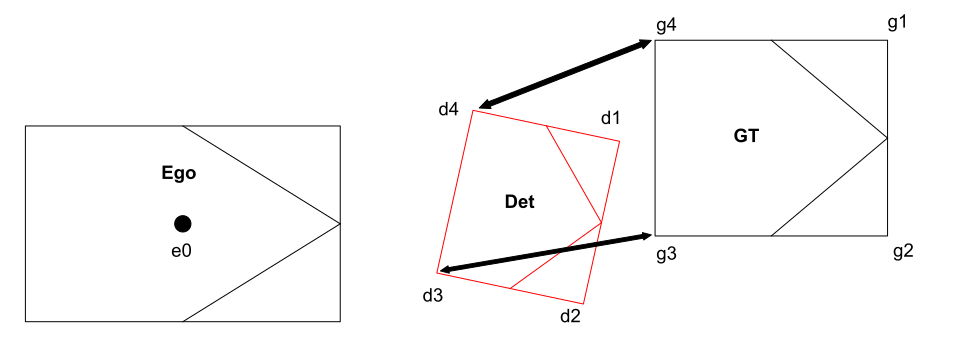

## FAQ for error

### rosbagを再生する度に検出結果が大きく変わる

- 以下のようにrosbagを再生する度に検出結果が変わる場合
  - 以下の例だとApが0.05程度ずれている
  - 2021/12/08現在、Apは0.002ぐらいしか振れない

```
1回目
[perception_evaluator_node.py-56] mAP: 0.099, mAPH: 0.087 (center distance 3d [m])
[perception_evaluator_node.py-56] AP , car ([1.0]): 0.394, bicycle ([1.0]): 0.000, pedestrian ([1.0]): 0.000, motorbike ([1.0]): 0.000

2回目
[perception_evaluator_node.py-56] mAP: 0.114, mAPH: 0.102 (center distance 3d [m])
[perception_evaluator_node.py-56] AP , car ([1.0]): 0.456, bicycle ([1.0]): 0.000, pedestrian ([1.0]): 0.000, motorbike ([1.0]): 0.000
```

- 解決法
  - <https://tier4.atlassian.net/wiki/spaces/AIP/pages/1436025612/cyclonedds> これを参考にCycloneDDSの設定を行う
- 解決できているかチェック
  - ノートPCだとrate 0.1ぐらいにすると安牌
  - 1frameの間にwidthが数万レベルで変化していたらconcatの点群が抜け落ちている
  - その場合通信の設定が正しいか見直す

```
ros2 bag play ./input_bag/ --clock 100 --rate 0.25
ros2 topic echo /sensing/lidar/concatenated/pointcloud --no-arr
```

```
header:
  stamp:
    sec: 1624164492
    nanosec: 350359040
  frame_id: base_link
height: 1
width: 215055
fields: '<sequence type: sensor_msgs/msg/PointField, length: 4>'
is_bigendian: false
point_step: 32
row_step: 1079360
data: '<sequence type: uint8, length: 6881760>'
is_dense: true

```

- よくあるミスその1：再起動時に必要なコマンドを忘れていないか

```
sudo sysctl -w net.core.rmem_max=2147483647
sudo ifconfig lo multicast
```

- 2021/12/08現在
  - rateを落としてrosbag playをするとconcat pointcloudまでは再現するようになる
  - centerpointの出力で20%のframeで30%くらいのobjectの個数がずれる（計6%程度はずれる）までは抑えられることを確認済

## FAQ for usage

### Q. predicted_objectとは何か

- predicted_object = Autowareの推論結果のこと

### Q. Plane distanceとは何か

- メトリクスにおけるTP/FPの判定において，Usecase評価でGround truth object とPredicted objectの**自車近傍の2点の距離のRMS**を以って判定する．具体的には，
1. GTとDetそれぞれにおいて，footprintの端点のうちEgoから近い面(=2点)を選択する．
2. その面同士における2通りの端点のペアから，合計距離が短いペアを選択し，これを自車近傍の2点する．
3. 各ペアの距離の2乗平均平方根をとり，これを*自車近傍の2点の距離のRMS**と呼ぶ．
- 例
1. GTにおいて，Egoから近い面として面g3g4を選択する．Detにおいては，面d3d4を選択する．
2. 端点のペアは，(g3d3, g4d4)と(g3d4, g4d3)の2通りある．合計距離が短いペアを選択する．図例では，(g3d3, g4d4)を選択する．
3. 自車近傍の2点の距離のRMS = sqrt ( ( g3d3^2 + g4d4^2 ) / 2 )
   - 詳しくは，`get_uc_plane_distance`関数を参照
   - 1の背景：検出された物体の奥行きが不明瞭なので，確度の高い自車近傍の点を選択している．

  - なぜか各rosbagごとに（crop_box_filterを変更させてrecordして）点群の最大距離が異なる -> 検出能力が変わっているのでPerceptionEvaluationConfigを変えて評価

### Q. uuidで具体的にできることはなにか？

- uuid = objectを一意に定めるためのid
  - Autowareだとuuid <https://github.com/tier4/autoware_iv_msgs/blob/main/autoware_perception_msgs/msg/object_recognition/DynamicObject.msg#L1>の表現を行う
  - nuscenesの表現だとinstance_token という名称
- 全Frameの大量のObjectResult (objectごとの結果）の結果に対して、「object "79151c9c4ebc7380555f25aecc031422" の結果は？」と投げると、そのobjectの
  - ground truth との誤差（center disntace, 面距離等々）
  - pointcloudが何点当たっているか
  - などの時間推移が表示できるようになる

### Q. sensor_model, vehicle_model, vehicle_idが変わっても、PerceptionEvaluationConfigは共通で良いのか

- database評価(= PerceptionEvaluationConfigで設定するもの）に関しては、基本的に検出能力が変わらない限り同じconfigで良いと思っている
- 例えば
  - センサの数が変わりました -> 検出能力が変わっている（例えば検出距離が変わる）のでPerceptionEvaluationConfigを変えて評価（=database評価したいn個のrosbagのセンサ構成は同じであってほしい）
  - calibrationし直しました -> 検出能力は買わないはずなので同じ設定で良い
  - 異なる車 -> センサが同じ配置なら検出能力は変わらないはず
  - （レアケース）各rosbagごとに（crop_box_filterを変更させてrecordして）点群の最大距離が異なる -> 検出能力が変わっているのでEvaluationConfigを変えて評価
