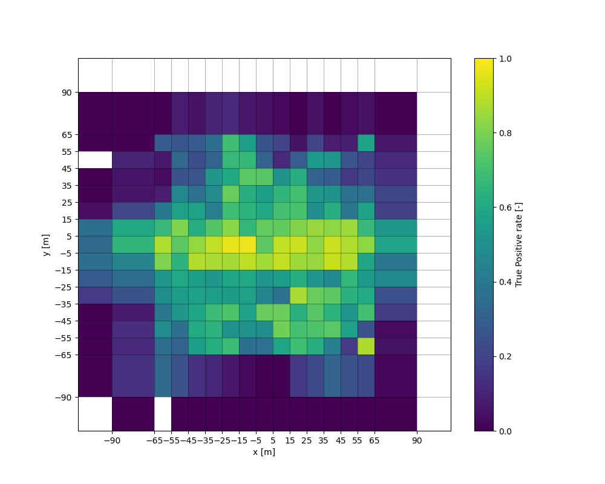
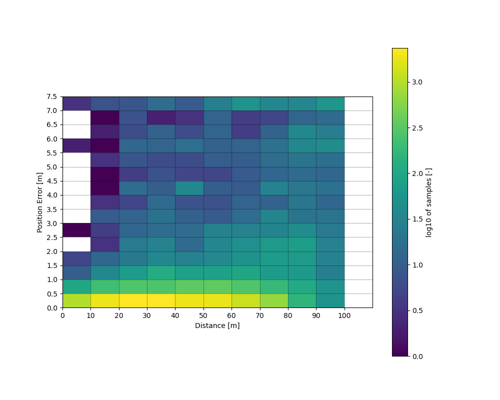

# [`PerceptionAnalyzer3DField`](../../../perception_eval/perception_eval/tool/perception_analyzer3dfield.py)

`PerceptionAnalyzer3DField`は、さまざまな変数の軸にわたる物体認識（Perception）のパフォーマンスを分析するためのクラスです。
このクラスは`PerceptionAnalyzer3D`の機能を拡張し、物体認識結果の統計分析を与えられた軸とその区間（ビン）に分割して行います。

分析には、各グリッドセルごとのサンプルの数（ヒストグラム）、検出確率（真陽性、真陰性、偽陰性、偽陽性の割合）、真陽性の場合は位置やオブジェクトのサイズなどの平均値、標準偏差、推定誤差および不確かさなどがあります。

`PerceptionAnalyzer3DField`クラスの主な特徴は次のとおりです：

- カスタムの軸とグリッド境界の設定が可能
- 各グリッドセルでの検出確率の計算
- 真陽性の場合の誤差と不確かさの分析

「不確かさ」とは、推定値が与えられたときの真値の確率分布を指します。

`PerceptionAnalyzer3D`と同様に、この解析では`driving_log_replayer`から保存された評価結果を使用します。

## グリットベース解析法

### 使用方法

本解析を行うスクリプトの例：[perception_field_analysis.py](../../../perception_eval/test/perception_field_analysis.py)

スクリプトを実行するには、次の入力を指定する必要があります：

- `result_root_directory`：結果ファイルが格納されているルートディレクトリ。
- `scenario_path`：シナリオファイルへのパス。

解析結果のプロットは`<your-result_root_directory>/plot/<object class>/`ディレクトリに保存されます。

以下は、このテストスクリプトを使用するための例のフォルダ構造です：

```md
BASE_FOLDER  
├── archives # 解析するシミュレート結果のルートディレクトリ
│ ├── xxx_archive
│ ├── core.xxx # coreファイルは使われない
│ └── scene_result.pkl # 解析対象の.pklファイル
└── scenario_x.yml # scenarioファイル
```

スクリプトを実行するには、以下のコマンドを使用します：

```sh
python3 test/perception_field_analysis.py -r ${BASE_FOLDER} -s ${BASE_FOLDER}/${SCENARIO_FILE}
```

### 手順

1. ファイルの読み込み

   `PerceptionAnalyzer3DField`アナライザーを初期化し、-rで指定したルートディレクトリ内にある全ての`scene_result.pkl`ファイルを読み込みます。
   これにより、.pklファイルを読み込み、データフレームを作成します。

   ```python
   # 初期化
   analyzer: PerceptionAnalyzer3DField = PerceptionAnalyzer3DField.from_scenario(
     result_root_directory,
     scenario_path,
   )

   # ファイルの読み込み
   pickle_file_paths = Path(result_root_directory).glob("**/scene_result.pkl")
   for filepath in pickle_file_paths:
     analyzer.add_from_pkl(filepath.as_posix())
   ```

2. （オプション）後処理

   データフレームに変数の列を追加して、分析可能な軸を拡張します。

   ```python
   # 列の追加
   analyzer.addAdditionalColumn()
   analyzer.addErrorColumns()
   ```

3. 軸の設定

   フィールド分析に使用する1つまたは2つの軸を設定します。データフレームの任意のラベル（列）を軸として使用できます。
   典型的な軸は位置です。

   ```python
   axis_x: PerceptionFieldAxis = PerceptionFieldAxis(type="length", data_label="x")
   axis_y: PerceptionFieldAxis = PerceptionFieldAxis(type="length", data_label="y")
   ```

   各軸には、ビンの境界の配列を設定することができます。

   ```python
   grid_axis_xy: np.ndarray = np.array([-35, -25, -15, -5, 5, 15, 25, 35])
   axis_x.setGridAxis(grid_axis_xy)
   axis_y.setGridAxis(grid_axis_xy)
   ```

4. 分析

   アナライザーに軸のペアを設定し、データを処理します。

   ```python
   error_field, uncertainty_field = analyzer.analyzeXY(axis_x, axis_y, **kwargs)
   ```

   - `error_field`: 与えられたデータの真値（Ground Truth）の値によって分布を計算した場合の解析結果
   - `uncertainty_field`: 与えられたデータの推定結果の値によって分布を計算した場合の解析結果

5. プロット

   プロットを設定し、フィールドをプロットメソッドに渡します。

   ```python
   plots: PerceptionFieldPlots = PerceptionFieldPlots(plot_dir)
   plots.plot_field_basics(error_field, prefix="XY")

   plots.save()
   ```

### 実装例

1. X軸：X座標、Y軸：Y座標、量：真陽率

   ```python
   # Define axes
   grid_axis_xy: np.ndarray = np.array([-90, -65, -55, -45, -35, -25, -15, -5, 5, 15, 25, 35, 45, 55, 65, 90])
   axis_x: PerceptionFieldAxis = PerceptionFieldAxis(quantity_type="length", data_label="x")
   axis_y: PerceptionFieldAxis = PerceptionFieldAxis(quantity_type="length", data_label="y")
   axis_x.set_grid_axis(grid_axis_xy)
   axis_y.set_grid_axis(grid_axis_xy)

   # Analyze 2D xy grid
   error_field, _ = analyzer.analyze_xy(axis_x, axis_y, **kwargs)

   # plots
   plots: PerceptionFieldPlots = PerceptionFieldPlots(plot_dir)
   plots.add(PerceptionFieldPlot("XY_ratio_tp", "True Positive rate [-]"))
   plots.last.plot_mesh_map(error_field, error_field.ratio_tp, vmin=0, vmax=1)
   plots.last.set_axes(error_field)
   ```

   

2. X軸：距離、Y軸：距離誤差、量：サンプル数(log)

   ```python
   # Define X axis
   axis_dist: PerceptionFieldAxis = PerceptionFieldAxis(quantity_type="length", data_label="dist", name="Distance")
   grid_axis_dist: np.ndarray = np.arange(0, 105, 10)
   axis_dist.set_grid_axis(grid_axis_dist)

   # Define Y axis
   axis_error_delta: PerceptionFieldAxis = PerceptionFieldAxis(
               quantity_type="length", data_label="error_delta", name="Position Error"
           )
   grid_axis_error: np.ndarray = np.arange(0, 8.0, 0.5)
   axis_error_delta.set_grid_axis(grid_axis_error)

   # Additional process for "dist" and "error_delta"
   analyzer.add_additional_column()
   analyzer.add_error_columns()

   # Analyze Dist-error grid
   error_field_range, _ = analyzer.analyze_xy(axis_dist, axis_error_delta, **kwargs)
   numb = error_field_range.num
   numb[numb == 0] = np.nan
   numb_log = np.log10(field.num)

   # plots
   plots: PerceptionFieldPlots = PerceptionFieldPlots(plot_dir)
   plots.add(PerceptionFieldPlot("dist_delta-error_numb_log", "Samples [-]"))
   plots.last.plot_mesh_map(error_field_range, numb_log, **kwargs)
   plots.last.set_axes(error_field_range)
   ```

   

## (グリッド) ポイント解析

この解析方法では、すべてのオブジェクトをポイントとして利用します。
現時点では、すべてのポイントは同じテーブルにありますが、今後の開発でグリッド中のテーブルに分割される予定です。

### 使用方法

サンプルスクリプトは[perception_field_points_analysis.py](../../../perception_eval/test/perception_field_points_analysis.py)で見ることができます。
