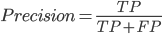
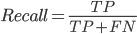
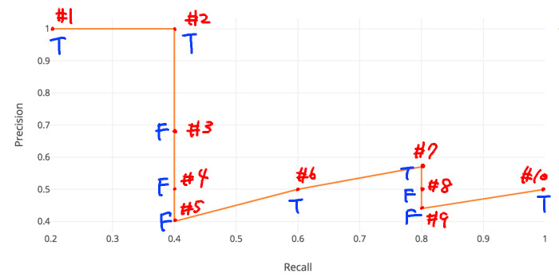
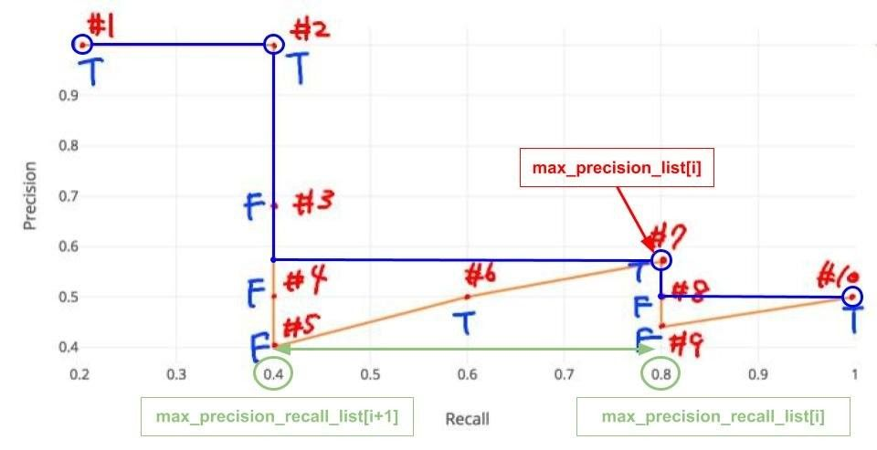
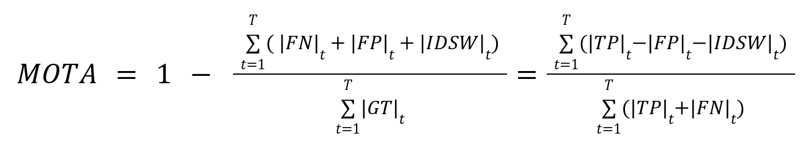
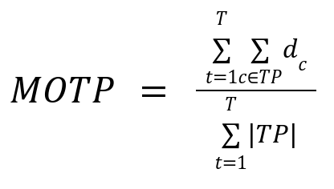
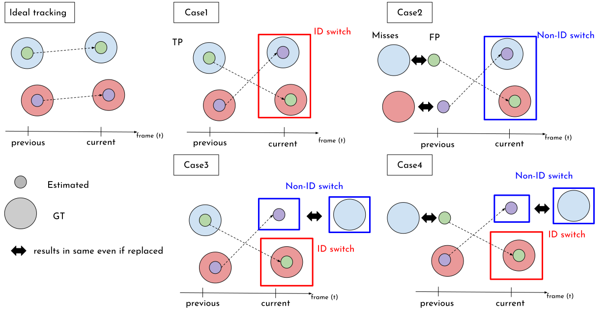
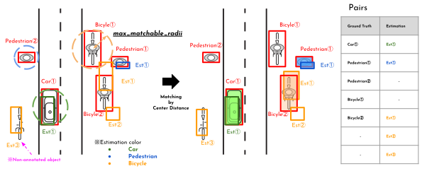
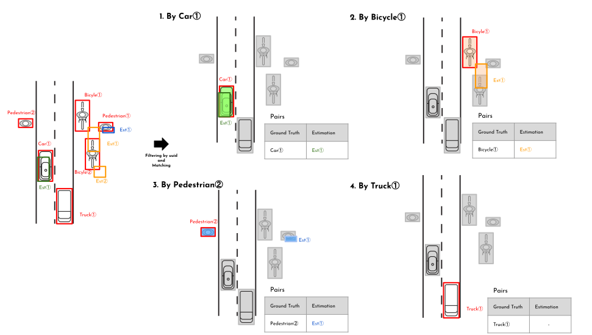
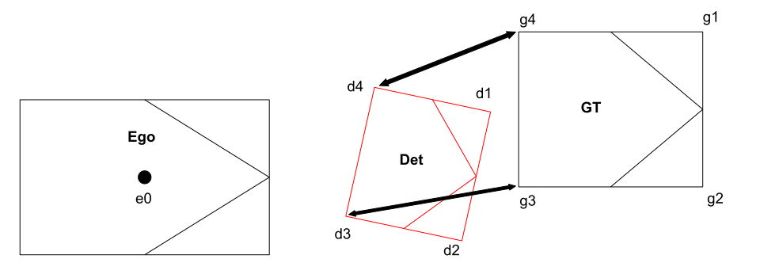

# Perception Evaluation Metrics

## [`<class> MetricsScore(...)`](../../../perception_eval/perception_eval/evaluation/metrics/metrics.py)

- detection/tracking/prediction の各評価指標を実行する class

| Argument |         type         | Description               |
| :------- | :------------------: | :------------------------ |
| `config` | `MetricsScoreConfig` | `MetricsScore`用の config |

- 入力された MetricsScoreConfig から，`detection/tracking/prediction_config`を生成

  - [`detection_config (DetectionMetricsConfig)`](../../../perception_eval/perception_eval/evaluation/metrics/config/detection_metrics_config.py)
  - [`tracking_config (TrackingMetricsConfig)`](../../../perception_eval/perception_eval/evaluation/metrics/config/tracking_metrics_config.py)
  - [`prediction_config (PredictionMetricsConfig)`](../../../perception_eval/perception_eval/evaluation/metrics/config/prediction_metrics_config.py)

- 各 config をもとにそれぞれの Metrics が計算される．

  - 3D 評価

    | Evaluation Task |      Metrics       |
    | :-------------- | :----------------: |
    | `Detection`     |     mAP / mAPH     |
    | `Tracking`      | mAP / mAPH / CLEAR |
    | `Prediction`    |       [TBD]        |

  - 2D 評価

    | Task               |   Metrics   |
    | :----------------- | :---------: |
    | `Detection2D`      |     mAP     |
    | `Tracking2D`       | mAP / CLEAR |
    | `Classification2D` |  Accuracy   |

```yaml
[2022-08-09 18:56:45,237] [INFO] [perception_lsim.py:214 <module>] Detection Metrics example (final_metric_score):
{'detection_config': {'center_distance_thresholds': [[1.0, 1.0, 1.0, 1.0], [2.0, 2.0, 2.0, 2.0]],
                      'center_distance_bev_thresholds': [[1.0, 1.0, 1.0, 1.0], [2.0, 2.0, 2.0, 2.0]],
                      'iou_3d_thresholds': [[0.5, 0.5, 0.5, 0.5]],
                      'iou_bev_thresholds': [[0.5, 0.5, 0.5, 0.5]],
                      'plane_distance_thresholds': [[2.0, 2.0, 2.0, 2.0], [3.0, 3.0, 3.0, 3.0]],
                      'target_labels': ['AutowareLabel.CAR', 'AutowareLabel.BICYCLE', 'AutowareLabel.PEDESTRIAN',
                                        'AutowareLabel.MOTORBIKE']},
 'mean_ap_values': ' --- length of element 6 ---,',
 'num_ground_truth_dict': {<AutowareLabel.PEDESTRIAN: 'pedestrian'>: 7657,
                           <AutowareLabel.MOTORBIKE: 'motorbike'>: 335,
                           <AutowareLabel.BICYCLE: 'bicycle'>: 1319,
                           <AutowareLabel.CAR: 'car'>: 3770},
 'prediction_config': None,
 'prediction_scores': [],
 'tracking_config': None,
 'tracking_scores': []}

 [2022-08-09 18:57:53,888] [INFO] [perception_lsim.py:270 <module>] Tracking Metrics example (tracking_final_metric_score):
{'detection_config': {'center_distance_thresholds': [[1.0, 1.0, 1.0, 1.0], [2.0, 2.0, 2.0, 2.0]],
                      'center_distance_bev_thresholds': [[1.0, 1.0, 1.0, 1.0], [2.0, 2.0, 2.0, 2.0]],
                      'iou_3d_thresholds': [[0.5, 0.5, 0.5, 0.5]],
                      'iou_bev_thresholds': [[0.5, 0.5, 0.5, 0.5]],
                      'plane_distance_thresholds': [[2.0, 2.0, 2.0, 2.0], [3.0, 3.0, 3.0, 3.0]],
                      'target_labels': ['AutowareLabel.CAR', 'AutowareLabel.BICYCLE', 'AutowareLabel.PEDESTRIAN',
                                        'AutowareLabel.MOTORBIKE']},
 'mean_ap_values': ' --- length of element 6 ---,',
 'num_ground_truth_dict': {<AutowareLabel.PEDESTRIAN: 'pedestrian'>: 7657,
                           <AutowareLabel.MOTORBIKE: 'motorbike'>: 335,
                           <AutowareLabel.BICYCLE: 'bicycle'>: 1319,
                           <AutowareLabel.CAR: 'car'>: 3770},
 'prediction_config': None,
 'prediction_scores': [],
 'tracking_config': {'center_distance_thresholds': [[1.0, 1.0, 1.0, 1.0], [2.0, 2.0, 2.0, 2.0]],
                     'iou_3d_thresholds': [[0.5, 0.5, 0.5, 0.5]],
                     'iou_bev_thresholds': [[0.5, 0.5, 0.5, 0.5]],
                     'plane_distance_thresholds': [[2.0, 2.0, 2.0, 2.0], [3.0, 3.0, 3.0, 3.0]],
                     'target_labels': ['AutowareLabel.CAR', 'AutowareLabel.BICYCLE', 'AutowareLabel.PEDESTRIAN',
                                       'AutowareLabel.MOTORBIKE']},
 'tracking_scores': ' --- length of element 6 ---,'}

```

## Detection

### [`<class> Map(...)`](../../../perception_eval/perception_eval/evaluation/metrics/detection/map.py)

- mAP (mean Average Precision) のスコア計算を行う class．

  - 内部で AP (Average Precision) / APH (Average Precision Weighted by Heading) を計算．
  - それらのクラス平均を取ることで mAP, mAPH を算出．

#### AP の計算方法

- 各オブジェクトのマッチングに対する TP/FP/FN 判定を元に Precision / Recall は以下のように定式化される．

  

  

- 上式から以下のような PR 曲線(Precision-Recall 曲線)が得られたとすると，その下部面積が AP(APH)である．

  

- 実際には，上記のような PR 曲線を補完してから下部面積を算出する．

  

```yaml
[2022-08-09 18:56:45,238] [INFO] [perception_lsim.py:220 <module>] mAP result example (final_metric_score.mean_ap_values[0].aps[0]):
{'aphs': [{'ap': 0.0,
           'fp_list': ' --- length of element 3768 ---,',
           'matching_average': 2.3086792761230375,
           'matching_mode': 'MatchingMode.CENTERDISTANCE',
           'matching_standard_deviation': 1.7793252530202338e-15,
           'matching_threshold_list': [1.0],
           'num_ground_truth': 3770,
           'objects_results_num': 3768,
           'target_labels': ['AutowareLabel.CAR'],
           'tp_list': ' --- length of element 3768 ---,',
           'tp_metrics': {'mode': 'TPMetricsAph'}},
          {'ap': 0.0,
           'fp_list': ' --- length of element 1186 ---,',
           'matching_average': 2.291362716605052,
           'matching_mode': 'MatchingMode.CENTERDISTANCE',
           'matching_standard_deviation': 0.828691650821576,
           'matching_threshold_list': [1.0],
           'num_ground_truth': 1319,
           'objects_results_num': 1186,
           'target_labels': ['AutowareLabel.BICYCLE'],
           'tp_list': ' --- length of element 1186 ---,',
           'tp_metrics': {'mode': 'TPMetricsAph'}},
          {'ap': 0.010345232018551354,
           'fp_list': ' --- length of element 7583 ---,',
           'matching_average': 2.7900883035521864,
           'matching_mode': 'MatchingMode.CENTERDISTANCE',
           'matching_standard_deviation': 3.6498079706351123,
           'matching_threshold_list': [1.0],
           'num_ground_truth': 7657,
           'objects_results_num': 7583,
           'target_labels': ['AutowareLabel.PEDESTRIAN'],
           'tp_list': ' --- length of element 7583 ---,',
           'tp_metrics': {'mode': 'TPMetricsAph'}},
          {'ap': 0.0,
           'fp_list': ' --- length of element 335 ---,',
           'matching_average': 2.308679276123039,
           'matching_mode': 'MatchingMode.CENTERDISTANCE',
           'matching_standard_deviation': 1.8215173398221747e-15,
           'matching_threshold_list': [1.0],
           'num_ground_truth': 335,
           'objects_results_num': 335,
           'target_labels': ['AutowareLabel.MOTORBIKE'],
           'tp_list': ' --- length of element 335 ---,',
           'tp_metrics': {'mode': 'TPMetricsAph'}}],
 'aps': [{'ap': 0.0,
          'fp_list': ' --- length of element 3768 ---,',
          'matching_average': 2.3086792761230375,
          'matching_mode': 'MatchingMode.CENTERDISTANCE',
          'matching_standard_deviation': 1.7793252530202338e-15,
          'matching_threshold_list': [1.0],
          'num_ground_truth': 3770,
          'objects_results_num': 3768,
          'target_labels': ['AutowareLabel.CAR'],
          'tp_list': ' --- length of element 3768 ---,',
          'tp_metrics': {'mode': 'TPMetricsAp'}},
         {'ap': 0.0,
          'fp_list': ' --- length of element 1186 ---,',
          'matching_average': 2.291362716605052,
          'matching_mode': 'MatchingMode.CENTERDISTANCE',
          'matching_standard_deviation': 0.828691650821576,
          'matching_threshold_list': [1.0],
          'num_ground_truth': 1319,
          'objects_results_num': 1186,
          'target_labels': ['AutowareLabel.BICYCLE'],
          'tp_list': ' --- length of element 1186 ---,',
          'tp_metrics': {'mode': 'TPMetricsAp'}},
         {'ap': 0.012201062955606672,
          'fp_list': ' --- length of element 7583 ---,',
          'matching_average': 2.7900883035521864,
          'matching_mode': 'MatchingMode.CENTERDISTANCE',
          'matching_standard_deviation': 3.6498079706351123,
          'matching_threshold_list': [1.0],
          'num_ground_truth': 7657,
          'objects_results_num': 7583,
          'target_labels': ['AutowareLabel.PEDESTRIAN'],
          'tp_list': ' --- length of element 7583 ---,',
          'tp_metrics': {'mode': 'TPMetricsAp'}},
         {'ap': 0.0,
          'fp_list': ' --- length of element 335 ---,',
          'matching_average': 2.308679276123039,
          'matching_mode': 'MatchingMode.CENTERDISTANCE',
          'matching_standard_deviation': 1.8215173398221747e-15,
          'matching_threshold_list': [1.0],
          'num_ground_truth': 335,
          'objects_results_num': 335,
          'target_labels': ['AutowareLabel.MOTORBIKE'],
          'tp_list': ' --- length of element 335 ---,',
          'tp_metrics': {'mode': 'TPMetricsAp'}}],
 'map': 0.003050265738901668,
 'maph': 0.0025863080046378386,
 'matching_mode': 'MatchingMode.CENTERDISTANCE',
 'matching_threshold_list': [1.0, 1.0, 1.0, 1.0],
 'target_labels': ['AutowareLabel.CAR', 'AutowareLabel.BICYCLE', 'AutowareLabel.PEDESTRIAN', 'AutowareLabel.MOTORBIKE']}
```

## Tracking

### `<class> TrackingMetricsScore(...)`

- tracking の メトリクススコアを計算する class．内部で CLEAR を計算し，MOTA (Multi-Object Tracking Accuracy) 　/　 MOTP (Multi-Object Tracking Precision) 　/　 IDswitch 等を計算する．

- MOTA，MOTP は以下のように定式かされる．

  

  

```yaml
[2022-08-09 18:57:53,889] [INFO] [perception_lsim.py:282 <module>] CLEAR result example (tracking_final_metric_score.tracking_scores[0].clears[0]):
{'clears': [{'fp': 3759.0,
             'id_switch': 0,
             'mota': 0.0,
             'motp': 0.8297818944410861,
             'objects_results_num': 3771,
             'tp': 12.0,
             'tp_matching_score': 9.957382733293032},
            {'fp': 1189.0,
             'id_switch': 0,
             'mota': 0.0,
             'motp': inf,
             'objects_results_num': 1189,
             'tp': 0.0,
             'tp_matching_score': 0.0},
            {'fp': 6834.0,
             'id_switch': 11,
             'mota': 0.0,
             'motp': 0.6495895085858145,
             'objects_results_num': 7526,
             'tp': 692.0,
             'tp_matching_score': 449.5159399413837},
            {'fp': 335.0,
             'id_switch': 0,
             'mota': 0.0,
             'motp': inf,
             'objects_results_num': 335,
             'tp': 0.0,
             'tp_matching_score': 0.0}],
 'matching_mode': 'MatchingMode.CENTERDISTANCE',
 'target_labels': ['AutowareLabel.CAR', 'AutowareLabel.BICYCLE', 'AutowareLabel.PEDESTRIAN', 'AutowareLabel.MOTORBIKE']}
```

### ID switch



## Matching

- 予測 object と Ground Truth のマッチング方式の class
  - 詳細は，[perception_eval/evaluation/matching/object_matching.py](../../../perception_eval/perception_eval/evaluation/matching/object_matching.py)を参照

| Matching Method    | Value                                                                 |
| ------------------ | --------------------------------------------------------------------- |
| Center Distance 3D | 2 つの object の 3D 中心間距離                                        |
| IoU 2D             | 2 つの object のの 2D IoU の値(3D オブジェクトの場合は，BEV から算出) |
| IoU 3D             | 2 つの object の 3D IoU の値                                          |
| Plane Distance     | 2 つの object の近傍 2 点の距離の RMS(詳細は後述)                     |

- オブジェクト同士のマッチングの条件は以下．デフォルトで Center Distance 3D がマッチング方式として使用される．

1. 最短距離の 同一クラスの GT と予測オブジェクトが優先的にマッチング
2. クラスに関係なく最短距離の GT と予測オブジェクトをマッチング



- UUID を指定した場合には，以下のプロセスでオブジェクトのペアが生成される．

1. 指定した UUID を持つ GT 以外をフィルタ
2. マッチング
3. GT とペアになっていない予測オブジェクトをフィルタ



### Plane distance

- メトリクスにおける TP/FP の判定において，Usecase 評価で Ground truth object と Predicted object の**自車近傍の 2 点の距離の RMS**を以って判定する．具体的には，

  1. GT と Det それぞれにおいて，footprint の端点のうち Ego から近い面(=2 点)を選択する．
  2. その面同士における 2 通りの端点のペアから，合計距離が短いペアを選択し，これを自車近傍の 2 点する．
  3. 各ペアの距離の 2 乗平均平方根をとり，これを\*自車近傍の 2 点の距離の RMS\*\*と呼ぶ．

- 例
  1. GT において，Ego から近い面として面 g3g4 を選択する．Det においては，面 d3d4 を選択する．
  2. 端点のペアは，(g3d3, g4d4)と(g3d4, g4d3)の 2 通りある．合計距離が短いペアを選択する．図例では，(g3d3, g4d4)を選択する．
  3. 自車近傍の 2 点の距離の RMS = sqrt ( ( g3d3^2 + g4d4^2 ) / 2 )
  - 詳しくは，`get_uc_plane_distance`関数を参照
  - 1 の背景：検出された物体の奥行きが不明瞭なので，確度の高い自車近傍の点を選択している．



- なぜか各 rosbag ごとに（crop_box_filter を変更させて record して）点群の最大距離が異なる -> 検出能力が変わっているので PerceptionEvaluationConfig を変えて評価

## TP Metrics

- True Positive 時の値を返す class
  - 詳細は，[perception_eval/evaluation/metrics/detection/tp_metrics.py](../../../perception_eval/perception_eval/evaluation/metrics/detection/tp_metrics.py)を参照

| TP Metrics          | Value                         |
| ------------------- | ----------------------------- |
| TPMetricsAp         | 1.0                           |
| TPMetricsAph        | 2 つの object の heading 残差 |
| TPMetricsConfidence | 予測 object の confidence     |

## Advanced detection metrics（運転文脈を考慮した検出メトリクス）

[`tier4/autoware-ml` PR #109](https://github.com/tier4/autoware-ml/pull/109)（コミット `fcf86419`）から移植した
オプトインのメトリクス群です。既存の mAP/mAPH に追加して計算され、既存の値を変更することはありません。
detection の `evaluation_config_dict` に以下のセクションを追加すると有効になり、セクションが無ければ従来通りの挙動です。

```yaml
advanced_detection_metrics:
  ranges: # 任意: box 中心の BEV 距離レンジ [min, max)
    - { name: 0_30, min_distance: 0.0, max_distance: 30.0 }
    - { name: 30_60, min_distance: 30.0, max_distance: 60.0 }
  class_groups: # 任意: target_labels を漏れなく分割するグループ（AutowareLabel 名）
    grouped_vehicle: [car, truck, bus]
    grouped_vru: [pedestrian, bicycle, motorbike]
    grouped_static: [hazard, unknown]
  filters: # 任意: 空間的なビュー（全体ビューは常に評価される）
    - { name: corridor, type: corridor, width_m: 3.0 }
    - { name: road, type: region, regions: [road, road_shoulder, crosswalk] }
    - { name: collision, type: collision }
  components: # 1 つ以上
    - { type: corner_error, tp_threshold: 2.0, percentiles: [95.0] }
    - { type: heading_flip, tp_threshold: 2.0, flip_threshold: 1.57079632679 }
    - { type: nearest_surface_error, tp_threshold: 2.0 }
    - { type: calibration, tp_threshold: 2.0, num_bins: 15 }
    - { type: confident_error, tp_threshold: 2.0, min_score: 0.1, score_threshold: 0.5 }
    - { type: confusion_matrix, match_threshold: 2.0, min_score: 0.1 }
    - { type: critical_fp_fn, confidences: [0.3, 0.5], match_threshold: 2.0 }
    - { type: collision_weighted_map, thresholds: [0.5, 1.0, 2.0, 4.0], decay: 0.5 }
  map: # region/collision フィルタと critical_fp_fn / collision_weighted_map に必須
    resolver: t4_scene_directory # <scene dir>/map/lanelet2_map.osm（または <scene dir>/*/map/...）
    # resolver: explicit
    # mapping: { "/path/to/scene": "/path/to/lanelet2_map.osm" }
```

`type` トークンは閉じたレジストリで、未知のトークンやキーは設定時にエラーになります。

### 出力

`MetricsScore.detection_metric_report`（`MetricReport`）が以下を持ちます。

- `values`: `{key: float}`。キーはスラッシュ区切り `detection/<taxonomy?>/<filter?>/<range?>/<metric-key>`
  （例: `detection/corner_mean_car`, `detection/road/0m_30m/corner_p95_car`,
  `detection/grouped/corridor/mflip_rate`）。`grouped` は `class_groups` 指定時、filter 階層は非 identity の
  フィルタ、range 階層は `ranges` 指定時のみ現れます。スラッシュを受け付けない下流には
  `MetricReport.to_flat_keys()`（`detection_road_0m_30m_corner_p95_car`）を使ってください。
- `coverage`: フィルタごと（および TTC 使用時は `ttc`）の `(covered_frames, seen_frames)`。
- `warnings`: 部分的なカバレッジやスキップしたフレーム（ポリゴン形状など）の注記。

`NaN` は「未定義」（そのクラスに TP が無い、カバーされたフレームが 0、など）を意味し、`0` として報告されることはありません。

### マッチング

各コンポーネントは独自の score 順グリーディマッチャ（フレーム毎の BEV 中心距離、同距離なら GT インデックスが小さい方）を使います。
box は `base_link` で `[cx, cy, cz, dx=length, dy=width, dz=height, yaw]` として扱い、`map` 座標系の object は
フレームの `base_link -> map` 変換で変換します。ポリゴン形状の object は非対応で、そのフレームは警告付きでスキップされます。

### コンポーネント

| `type`                   | 定義（既定値）                                                                                                                                                                               | キー                                                                                                        |
| ------------------------ | -------------------------------------------------------------------------------------------------------------------------------------------------------------------------------------------- | ----------------------------------------------------------------------------------------------------------- |
| `corner_error`           | TP（`tp_threshold=2.0`）の BEV 4 頂点変位の平均（4 通りの巡回対応の最小）。クラス毎の mean / max / `percentiles=[95]` と全クラス平均。                                                       | `corner_mean_<c>`, `corner_max_<c>`, `corner_p95_<c>`, `mcorner_mean`, `mcorner_max`                        |
| `heading_flip`           | yaw 誤差（wrap 後の絶対値）が `flip_threshold=pi/2` を超える TP の割合。                                                                                                                     | `flip_rate_<c>`, `flip_count_<c>`, `mflip_rate`                                                             |
| `nearest_surface_error`  | 自車から BEV footprint 最近点までの距離について `d(pred) - d(gt)`（正 = 予測の手前面が遠すぎる = ブレーキ遅れ）。mean / `low_percentile=5` / `high_percentile=95` / 絶対値最大。             | `nsurf_mean_<c>`, `nsurf_low_<c>`, `nsurf_high_<c>`, `nsurf_absmax_<c>`, `mnsurf_high`, `mnsurf_absmax`     |
| `calibration`            | score と TP precision の期待較正誤差（`num_bins=15` の等幅ビン）。score は `[0, 1]` の確率であること。                                                                                       | `ece`, `ece_macro`                                                                                          |
| `confident_error`        | score `>= min_score=0.1` の FP のうち score `>= score_threshold=0.5` の割合。                                                                                                                | `confident_error_rate`, `confident_error_count`, `confident_errors_per_frame`                               |
| `confusion_matrix`       | score `>= min_score=0.1` の予測をクラス非依存に `match_threshold=2.0` でマッチし、マッチした `(true, pred)` ラベル対のみを数える。                                                           | `confusion_<true>__<pred>`                                                                                  |
| `critical_fp_fn`         | 各 `confidences=[0.3, 0.5]` で クラス非依存マッチ（`match_threshold=2.0`）。到達可能性 TTC が有限な未マッチ予測 / GT を数え、TTC がカバーされたフレーム数で割る。`map` 必須。                | `critical_fp_<conf>`, `critical_fn_<conf>`, `critical_fp_<c>_<conf>`, `critical_fn_<c>_<conf>`（例 `0p5m`） |
| `collision_weighted_map` | 各 object を `exp(-decay * TTC)`（`decay=0.5`、到達不能は 0）で重み付けした nuScenes 形式 AP（`Ap` と同じ規約）。TP は GT の重み、FP は自身の重み。`thresholds` とクラスで平均。`map` 必須。 | `cw_mAP`, `cw_mAP_<c>`                                                                                      |

### フィルタ

| `type`      | 残す要素                                                                                                                                                             | map  |
| ----------- | -------------------------------------------------------------------------------------------------------------------------------------------------------------------- | ---- |
| `corridor`  | `base_link` で前方（`x >= 0`）の footprint が `abs(y) <= width_m / 2` の帯と重なる box。                                                                             | 不要 |
| `region`    | lanelet2 の `regions`（lanelet の `subtype` または area way の `type`）の和集合と footprint が交差する box。`margin_m` で内側に削り、`expand: true` で外側に広げる。 | 必要 |
| `collision` | ホライズン内に自車が到達可能な領域（lanelet 速度制限・操舵制約・走行可能領域でクリップ）と交差する box。`horizon_s`, `dt_s`, `max_lateral_accel_mps2` など。         | 必要 |

lanelet マップ（または自車姿勢）が無いシーンのフレームは map 依存ビューからのみ除外され、全体ビューには残ります。
カバーされたフレームが 0 のビューは全キーが `NaN` になり、警告が 1 件出ます。

### 到達可能性モデル（TTC）

自車を含む全エージェントがクラス毎の最大合法速度で動くと仮定します。車輪付きクラス（`car`, `truck`, `bus`, `motorbike`）は
lanelet の `speed_limit`（マップ外は `map.max_speed_mps=16.7`）で一定曲率の弧を描き、VRU（`pedestrian` 3 m/s,
`bicycle` 6 m/s, `animal` 4 m/s）は全方向に移動し、静的クラス（`hazard`, `unknown`）は footprint を保ちます。
TTC は自車と object の「時刻 `t` に到達可能な集合」が初めて重なる `t`、無ければ `inf` です。したがって同速で先行する
車両は到達不能となり critical にはなりません。クラス表は `map.collision_kinds` / `map.vru_speeds` で上書きできます。

### 例

```python
score = evaluator.get_scene_result()
report = score.detection_metric_report  # セクション未設定なら None
print(report.summary())
value = report.values["detection/road/0m_30m/corner_p95_car"]
flat = report.to_flat_keys()
```
