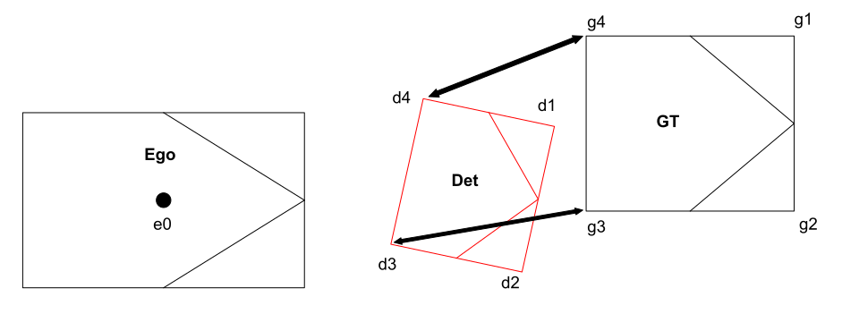

# Perception Evaluation Metrics

## MetricsScore

- detection/tracking/prediction の各評価指標を実行する class

| Argument |         type         | Description               |
| :------- | :------------------: | :------------------------ |
| `config` | `MetricsScoreConfig` | `MetricsScore`用の config |

- 入力された MetricsScoreConfig から，`detection/tracking/prediction_config`を生成

  - `detection_config (DetectionMetricsConfig)`
  - `tracking_config (TrackingMetricsConfig)`
  - `prediction_config (PredictionMetricsConfig)`

- 各 config をもとにそれぞれの Metrics が計算される．

| EvaluationTask |   Metrics   |
| :------------- | :---------: |
| `Detection`    |     mAP     |
| `Tracking`     | mAP / CLEAR |
| `Prediction`   |    [TBD]    |

```yaml
[2022-08-09 18:56:45,237] [INFO] [perception_lsim.py:214 <module>] Detection Metrics example (final_metric_score):
{'detection_config': {'center_distance_thresholds': [[1.0, 1.0, 1.0, 1.0], [2.0, 2.0, 2.0, 2.0]],
                      'iou_3d_thresholds': [[0.5, 0.5, 0.5, 0.5]],
                      'iou_bev_thresholds': [[0.5, 0.5, 0.5, 0.5]],
                      'plane_distance_thresholds': [[2.0, 2.0, 2.0, 2.0], [3.0, 3.0, 3.0, 3.0]],
                      'target_labels': ['AutowareLabel.CAR', 'AutowareLabel.BICYCLE', 'AutowareLabel.PEDESTRIAN',
                                        'AutowareLabel.MOTORBIKE']},
 'maps': ' --- length of element 6 ---,',
 'num_ground_truth_dict': {<AutowareLabel.PEDESTRIAN: 'pedestrian'>: 7657,
                           <AutowareLabel.MOTORBIKE: 'motorbike'>: 335,
                           <AutowareLabel.BICYCLE: 'bicycle'>: 1319,
                           <AutowareLabel.CAR: 'car'>: 3770},
 'prediction_config': None,
 'prediction_scores': [],
 'tracking_config': None,
 'tracking_scores': []}

 [2022-08-09 18:57:53,888] [INFO] [perception_lsim.py:270 <module>] Tracking Metrics example (tracking_final_metric_score):
{'detection_config': {'center_distance_thresholds': [[1.0, 1.0, 1.0, 1.0], [2.0, 2.0, 2.0, 2.0]],
                      'iou_3d_thresholds': [[0.5, 0.5, 0.5, 0.5]],
                      'iou_bev_thresholds': [[0.5, 0.5, 0.5, 0.5]],
                      'plane_distance_thresholds': [[2.0, 2.0, 2.0, 2.0], [3.0, 3.0, 3.0, 3.0]],
                      'target_labels': ['AutowareLabel.CAR', 'AutowareLabel.BICYCLE', 'AutowareLabel.PEDESTRIAN',
                                        'AutowareLabel.MOTORBIKE']},
 'maps': ' --- length of element 6 ---,',
 'num_ground_truth_dict': {<AutowareLabel.PEDESTRIAN: 'pedestrian'>: 7657,
                           <AutowareLabel.MOTORBIKE: 'motorbike'>: 335,
                           <AutowareLabel.BICYCLE: 'bicycle'>: 1319,
                           <AutowareLabel.CAR: 'car'>: 3770},
 'prediction_config': None,
 'prediction_scores': [],
 'tracking_config': {'center_distance_thresholds': [[1.0, 1.0, 1.0, 1.0], [2.0, 2.0, 2.0, 2.0]],
                     'iou_3d_thresholds': [[0.5, 0.5, 0.5, 0.5]],
                     'iou_bev_thresholds': [[0.5, 0.5, 0.5, 0.5]],
                     'plane_distance_thresholds': [[2.0, 2.0, 2.0, 2.0], [3.0, 3.0, 3.0, 3.0]],
                     'target_labels': ['AutowareLabel.CAR', 'AutowareLabel.BICYCLE', 'AutowareLabel.PEDESTRIAN',
                                       'AutowareLabel.MOTORBIKE']},
 'tracking_scores': ' --- length of element 6 ---,'}

```

## Detection

### `Map`

- mAP のスコア計算を行う class．内部で AP / APH を計算し，それらのクラス平均を取る．

```yaml
[2022-08-09 18:56:45,238] [INFO] [perception_lsim.py:220 <module>] mAP result example (final_metric_score.maps[0].aps[0]):
{'aphs': [{'ap': 0.0,
           'fp_list': ' --- length of element 3768 ---,',
           'matching_average': 2.3086792761230375,
           'matching_mode': 'MatchingMode.CENTERDISTANCE',
           'matching_standard_deviation': 1.7793252530202338e-15,
           'matching_threshold_list': [1.0],
           'num_ground_truth': 3770,
           'objects_results_num': 3768,
           'target_labels': ['AutowareLabel.CAR'],
           'tp_list': ' --- length of element 3768 ---,',
           'tp_metrics': {'mode': 'TPMetricsAph'}},
          {'ap': 0.0,
           'fp_list': ' --- length of element 1186 ---,',
           'matching_average': 2.291362716605052,
           'matching_mode': 'MatchingMode.CENTERDISTANCE',
           'matching_standard_deviation': 0.828691650821576,
           'matching_threshold_list': [1.0],
           'num_ground_truth': 1319,
           'objects_results_num': 1186,
           'target_labels': ['AutowareLabel.BICYCLE'],
           'tp_list': ' --- length of element 1186 ---,',
           'tp_metrics': {'mode': 'TPMetricsAph'}},
          {'ap': 0.010345232018551354,
           'fp_list': ' --- length of element 7583 ---,',
           'matching_average': 2.7900883035521864,
           'matching_mode': 'MatchingMode.CENTERDISTANCE',
           'matching_standard_deviation': 3.6498079706351123,
           'matching_threshold_list': [1.0],
           'num_ground_truth': 7657,
           'objects_results_num': 7583,
           'target_labels': ['AutowareLabel.PEDESTRIAN'],
           'tp_list': ' --- length of element 7583 ---,',
           'tp_metrics': {'mode': 'TPMetricsAph'}},
          {'ap': 0.0,
           'fp_list': ' --- length of element 335 ---,',
           'matching_average': 2.308679276123039,
           'matching_mode': 'MatchingMode.CENTERDISTANCE',
           'matching_standard_deviation': 1.8215173398221747e-15,
           'matching_threshold_list': [1.0],
           'num_ground_truth': 335,
           'objects_results_num': 335,
           'target_labels': ['AutowareLabel.MOTORBIKE'],
           'tp_list': ' --- length of element 335 ---,',
           'tp_metrics': {'mode': 'TPMetricsAph'}}],
 'aps': [{'ap': 0.0,
          'fp_list': ' --- length of element 3768 ---,',
          'matching_average': 2.3086792761230375,
          'matching_mode': 'MatchingMode.CENTERDISTANCE',
          'matching_standard_deviation': 1.7793252530202338e-15,
          'matching_threshold_list': [1.0],
          'num_ground_truth': 3770,
          'objects_results_num': 3768,
          'target_labels': ['AutowareLabel.CAR'],
          'tp_list': ' --- length of element 3768 ---,',
          'tp_metrics': {'mode': 'TPMetricsAp'}},
         {'ap': 0.0,
          'fp_list': ' --- length of element 1186 ---,',
          'matching_average': 2.291362716605052,
          'matching_mode': 'MatchingMode.CENTERDISTANCE',
          'matching_standard_deviation': 0.828691650821576,
          'matching_threshold_list': [1.0],
          'num_ground_truth': 1319,
          'objects_results_num': 1186,
          'target_labels': ['AutowareLabel.BICYCLE'],
          'tp_list': ' --- length of element 1186 ---,',
          'tp_metrics': {'mode': 'TPMetricsAp'}},
         {'ap': 0.012201062955606672,
          'fp_list': ' --- length of element 7583 ---,',
          'matching_average': 2.7900883035521864,
          'matching_mode': 'MatchingMode.CENTERDISTANCE',
          'matching_standard_deviation': 3.6498079706351123,
          'matching_threshold_list': [1.0],
          'num_ground_truth': 7657,
          'objects_results_num': 7583,
          'target_labels': ['AutowareLabel.PEDESTRIAN'],
          'tp_list': ' --- length of element 7583 ---,',
          'tp_metrics': {'mode': 'TPMetricsAp'}},
         {'ap': 0.0,
          'fp_list': ' --- length of element 335 ---,',
          'matching_average': 2.308679276123039,
          'matching_mode': 'MatchingMode.CENTERDISTANCE',
          'matching_standard_deviation': 1.8215173398221747e-15,
          'matching_threshold_list': [1.0],
          'num_ground_truth': 335,
          'objects_results_num': 335,
          'target_labels': ['AutowareLabel.MOTORBIKE'],
          'tp_list': ' --- length of element 335 ---,',
          'tp_metrics': {'mode': 'TPMetricsAp'}}],
 'map': 0.003050265738901668,
 'maph': 0.0025863080046378386,
 'matching_mode': 'MatchingMode.CENTERDISTANCE',
 'matching_threshold_list': [1.0, 1.0, 1.0, 1.0],
 'target_labels': ['AutowareLabel.CAR', 'AutowareLabel.BICYCLE', 'AutowareLabel.PEDESTRIAN', 'AutowareLabel.MOTORBIKE']}
```

## Tracking

## `TrackingMetricsScore`

- tracking の メトリクススコアを計算する class.内部で CLEAR を計算し，MOTA 　/　 MOTP 　/　 IDswitch 等を計算する．

```yaml
[2022-08-09 18:57:53,889] [INFO] [perception_lsim.py:282 <module>] CLEAR result example (tracking_final_metric_score.tracking_scores[0].clears[0]):
{'clears': [{'fp': 3759.0,
             'id_switch': 0,
             'mota': 0.0,
             'motp': 0.8297818944410861,
             'objects_results_num': 3771,
             'tp': 12.0,
             'tp_matching_score': 9.957382733293032},
            {'fp': 1189.0,
             'id_switch': 0,
             'mota': 0.0,
             'motp': inf,
             'objects_results_num': 1189,
             'tp': 0.0,
             'tp_matching_score': 0.0},
            {'fp': 6834.0,
             'id_switch': 11,
             'mota': 0.0,
             'motp': 0.6495895085858145,
             'objects_results_num': 7526,
             'tp': 692.0,
             'tp_matching_score': 449.5159399413837},
            {'fp': 335.0,
             'id_switch': 0,
             'mota': 0.0,
             'motp': inf,
             'objects_results_num': 335,
             'tp': 0.0,
             'tp_matching_score': 0.0}],
 'matching_mode': 'MatchingMode.CENTERDISTANCE',
 'target_labels': ['AutowareLabel.CAR', 'AutowareLabel.BICYCLE', 'AutowareLabel.PEDESTRIAN', 'AutowareLabel.MOTORBIKE']}
```

## Matching

- 予測 object と Ground Truth のマッチング方式の class
  - 詳細は，[awml_evaluation/evaluation/matching/object_matching.py](../../awml_evaluation/awml_evaluation/evaluation/matching/object_matching.py)を参照

| Matching Method    | Value                                             |
| ------------------ | ------------------------------------------------- |
| Center Distance 3D | 2 つの object の 3D 中心間距離                    |
| IoU BEV            | 2 つの object のの IoU BEV の値                   |
| IoU 3D             | 2 つの object の 3D IoU の値                      |
| Plane Distance     | 2 つの object の近傍 2 点の距離の RMS(詳細は後述) |

### Plane distance

- メトリクスにおける TP/FP の判定において，Usecase 評価で Ground truth object と Predicted object の**自車近傍の 2 点の距離の RMS**を以って判定する．具体的には，

  1. GT と Det それぞれにおいて，footprint の端点のうち Ego から近い面(=2 点)を選択する．
  2. その面同士における 2 通りの端点のペアから，合計距離が短いペアを選択し，これを自車近傍の 2 点する．
  3. 各ペアの距離の 2 乗平均平方根をとり，これを\*自車近傍の 2 点の距離の RMS\*\*と呼ぶ．

- 例
  1. GT において，Ego から近い面として面 g3g4 を選択する．Det においては，面 d3d4 を選択する．
  2. 端点のペアは，(g3d3, g4d4)と(g3d4, g4d3)の 2 通りある．合計距離が短いペアを選択する．図例では，(g3d3, g4d4)を選択する．
  3. 自車近傍の 2 点の距離の RMS = sqrt ( ( g3d3^2 + g4d4^2 ) / 2 )
  - 詳しくは，`get_uc_plane_distance`関数を参照
  - 1 の背景：検出された物体の奥行きが不明瞭なので，確度の高い自車近傍の点を選択している．



- なぜか各 rosbag ごとに（crop_box_filter を変更させて record して）点群の最大距離が異なる -> 検出能力が変わっているので PerceptionEvaluationConfig を変えて評価

## TP Metrics

- True Positive 時の値を返す class
  - 詳細は，[awml_evaluation/evaluation/metrics/detection/tp_metrics.py](../../awml_evaluation/awml_evaluation/evaluation/metrics/detection/tp_metrics.py)を参照

| TP Metrics          | Value                         |
| ------------------- | ----------------------------- |
| TPMetricsAp         | 1.0                           |
| TPMetricsAph        | 2 つの object の heading 残差 |
| TPMetricsConfidence | 予測 object の confidence     |
